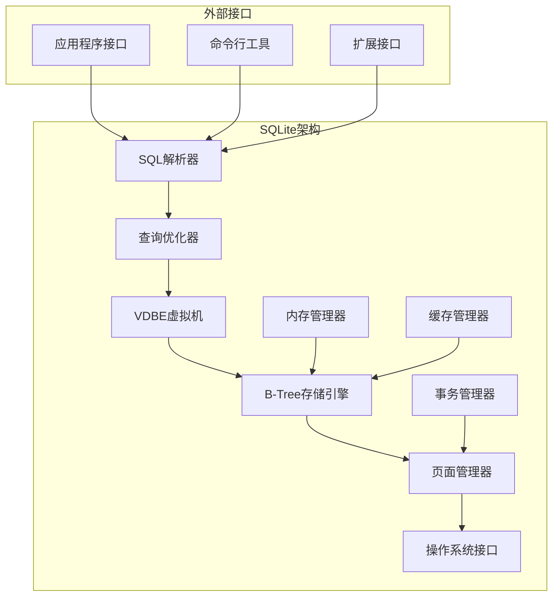
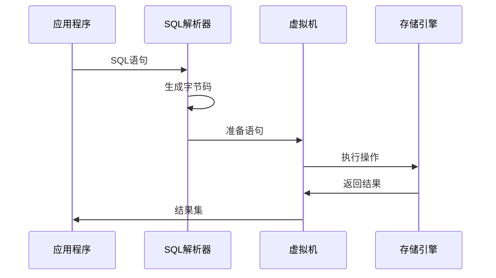
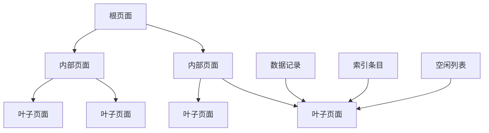
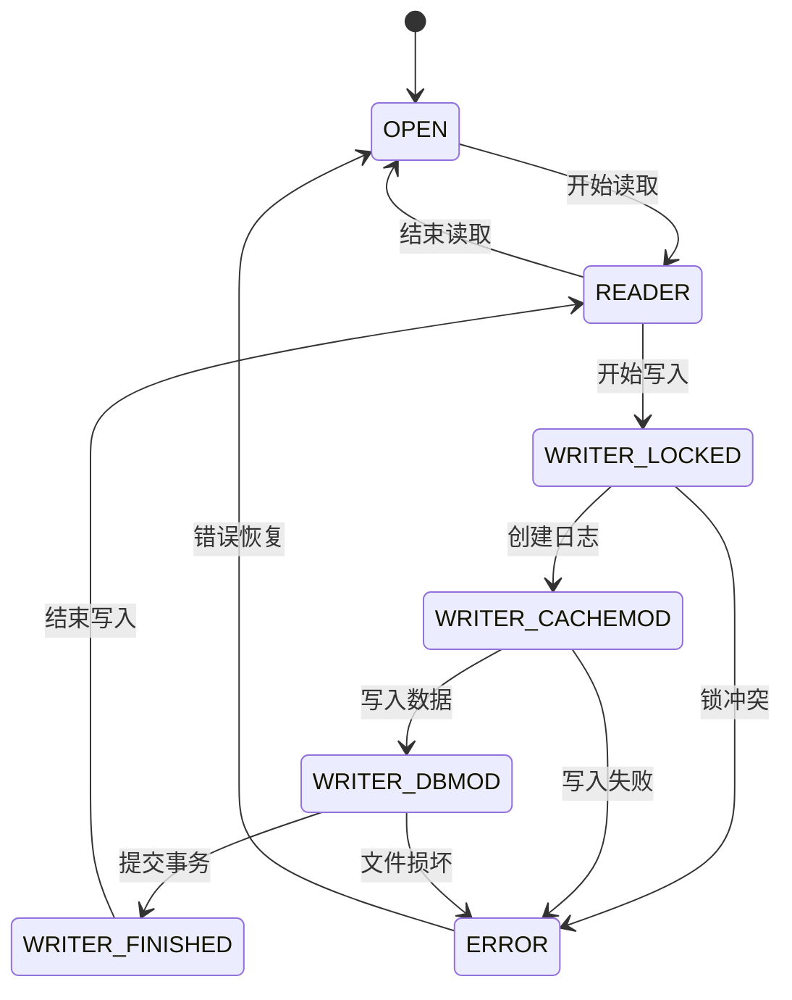

# SQLite项目概述

<cite>
**本文档中引用的文件**
- [README.md](file://README.md)
- [LICENSE.md](file://LICENSE.md)
- [main.c](file://src/main.c)
- [sqliteInt.h](file://src/sqliteInt.h)
- [vdbe.c](file://src/vdbe.c)
- [btree.c](file://src/btree.c)
- [pager.c](file://src/pager.c)
- [parse.y](file://src/parse.y)
- [compile-for-unix.md](file://doc/compile-for-unix.md)
- [compile-for-windows.md](file://doc/compile-for-windows.md)
</cite>

## 目录
1. [项目简介](#项目简介)
2. [核心特性](#核心特性)
3. [公共领域许可](#公共领域许可)
4. [项目架构概览](#项目架构概览)
5. [核心组件详解](#核心组件详解)
6. [应用场景](#应用场景)
7. [设计哲学与性能目标](#设计哲学与性能目标)
8. [构建与集成](#构建与集成)
9. [总结](#总结)

## 项目简介

SQLite是一个轻量级、零配置的嵌入式关系型数据库引擎，专为在单个设备上运行而设计。作为一个完全自包含、无服务器、零配置的数据库解决方案，SQLite已经成为全球范围内最广泛使用的数据库管理系统之一。

该项目采用公共领域许可，这意味着任何人都可以自由使用、修改和分发SQLite代码，无需支付任何费用或遵守复杂的许可证条款。这种开放性使得SQLite能够被集成到各种应用程序中，从移动应用到桌面软件，再到Web浏览器和嵌入式系统。

**节来源**
- [README.md](file://README.md#L1-L50)
- [LICENSE.md](file://LICENSE.md#L1-L30)

## 核心特性

### 零配置设计
SQLite的最大特色在于其"零配置"理念。用户无需进行任何设置即可开始使用：
- **自包含**: 所有功能都包含在一个单一的动态库中
- **无服务器**: 不需要单独的数据库服务器进程
- **零安装**: 可以直接复制到目标系统并立即使用
- **跨平台**: 支持多种操作系统和硬件架构

### 自包含与便携性
SQLite数据库以单一文件的形式存在，这带来了以下优势：
- **易于备份**: 整个数据库只需复制一个文件
- **便于传输**: 可以轻松地在不同系统间迁移
- **版本控制友好**: 数据库文件可以纳入版本控制系统

### 跨平台支持
SQLite支持广泛的平台和操作系统：
- **操作系统**: Windows、Linux、macOS、Unix变种
- **处理器架构**: x86、x64、ARM、MIPS等
- **编程语言**: 提供C/C++接口，也支持其他语言绑定

**节来源**
- [README.md](file://README.md#L15-L40)

## 公共领域许可

SQLite采用公共领域许可，这是其最重要的特征之一。公共领域意味着：

### 完全自由使用
- **无版权限制**: 任何人都可以自由使用SQLite
- **无专利限制**: 没有任何专利保护阻止使用
- **无使用费用**: 完全免费，无需支付许可费

### 开发者社区意义
公共领域许可为开发者社区带来了巨大价值：
- **创新促进**: 开发者可以自由改进和扩展SQLite
- **教育友好**: 在学术研究和教学中不受限制
- **企业安全**: 企业可以放心使用，不用担心法律风险

**节来源**
- [LICENSE.md](file://LICENSE.md#L1-L86)

## 项目架构概览

SQLite采用模块化设计，主要由以下几个核心子系统组成：



**图表来源**
- [main.c](file://src/main.c#L1-L50)
- [sqliteInt.h](file://src/sqliteInt.h#L1658-L1680)

### 架构特点
- **模块化设计**: 各组件职责明确，便于维护和扩展
- **层次化结构**: 从SQL解析到物理存储的清晰层次
- **可插拔接口**: 支持自定义存储和操作系统接口

**节来源**
- [README.md](file://README.md#L313-L388)

## 核心组件详解

### SQL解析器 (SQL Parser)
SQL解析器负责将SQL语句转换为内部表示形式：

```mermaid
flowchart TD
A[SQL输入] --> B[词法分析器]
B --> C[语法分析器]
C --> D[LALR(1)解析表]
D --> E[抽象语法树]
E --> F[执行计划生成]
G[LEMON语法生成器] --> D
H[parse.y语法文件] --> G
```

**图表来源**
- [parse.y](file://src/parse.y#L1-L100)

#### 关键特性
- **标准兼容**: 支持大部分SQL-92标准
- **错误处理**: 提供详细的语法错误信息
- **扩展能力**: 支持自定义函数和操作符

**节来源**
- [parse.y](file://src/parse.y#L1-L200)

### VDBE虚拟机 (Virtual Database Engine)
VDBE是SQLite的核心执行引擎，类似于字节码虚拟机：



**图表来源**
- [vdbe.c](file://src/vdbe.c#L1-L200)

#### 执行特点
- **字节码执行**: 将SQL转换为字节码序列
- **优化执行**: 内置多种执行优化策略
- **调试支持**: 提供详细的执行跟踪功能

**节来源**
- [vdbe.c](file://src/vdbe.c#L1-L200)

### B-Tree存储引擎
B-Tree是SQLite的主要存储结构，提供高效的随机访问和顺序扫描：



**图表来源**
- [btree.c](file://src/btree.c#L1-L200)

#### 存储特性
- **平衡树结构**: 确保查询性能的一致性
- **页面大小灵活**: 支持从小于1KB到大于64KB的页面
- **自动压缩**: 内置空间回收机制

**节来源**
- [btree.c](file://src/btree.c#L1-L200)

### 页面管理器 (Pager)
页面管理器负责数据库文件的读写操作和事务管理：



**图表来源**
- [pager.c](file://src/pager.c#L1-L200)

#### 事务特性
- **原子性**: 事务要么全部成功，要么全部失败
- **一致性**: 维护数据库的一致状态
- **隔离性**: 多个事务并发执行时相互隔离
- **持久性**: 一旦提交，数据永久保存

**节来源**
- [pager.c](file://src/pager.c#L1-L200)

## 应用场景

### 移动应用
SQLite在移动应用开发中占据重要地位：
- **iOS应用**: iOS系统内置SQLite支持
- **Android应用**: Android框架默认数据库
- **跨平台框架**: React Native、Flutter等使用SQLite

#### 移动应用优势
- **离线功能**: 支持离线数据存储和同步
- **性能优异**: 针对移动设备优化
- **资源节省**: 占用内存和存储空间小

### Web浏览器
现代Web浏览器广泛使用SQLite：
- **Chrome浏览器**: 使用SQLite存储书签、历史记录
- **Firefox浏览器**: 支持SQLite扩展
- **Edge浏览器**: 内置SQLite支持

#### 浏览器应用场景
- **本地存储**: IndexedDB底层实现
- **扩展存储**: 浏览器扩展的数据存储
- **缓存管理**: 网页内容缓存

### 嵌入式系统
SQLite在嵌入式系统中的应用：
- **路由器**: 路由器配置和日志存储
- **智能家居**: 设备状态和配置数据
- **工业控制**: 生产数据和监控信息

#### 嵌入式优势
- **可靠性高**: 经过大量实际应用验证
- **资源占用少**: 适合资源受限环境
- **维护简单**: 无需专门的数据库管理员

### 桌面软件
各种桌面应用程序使用SQLite：
- **办公软件**: 文档元数据和配置
- **媒体播放器**: 播放列表和收藏夹
- **游戏**: 游戏进度和设置

### 服务器应用
即使在服务器环境中，SQLite也有其用武之地：
- **小型网站**: 静态内容较少的网站
- **开发测试**: 开发和测试环境
- **边缘计算**: 边缘节点数据存储

**节来源**
- [README.md](file://README.md#L15-L40)

## 设计哲学与性能目标

### 设计哲学

#### 简单优于复杂
SQLite坚持"简单即美"的设计原则：
- **最小化依赖**: 避免外部库依赖
- **清晰接口**: 提供简洁明了的API
- **文档完善**: 详细的文档和示例

#### 可靠性第一
- **严格测试**: 包含大量单元测试和集成测试
- **错误处理**: 完善的错误检测和恢复机制
- **数据完整性**: 强制约束和事务保证

#### 性能与大小的平衡
- **快速启动**: 启动时间短，内存占用小
- **高效执行**: 查询和更新操作优化
- **紧凑代码**: 编译后体积小

### 性能目标

#### 响应时间优化
- **毫秒级响应**: 大多数操作在毫秒级别完成
- **即时查询**: 复杂查询也能快速返回结果
- **低延迟**: 网络无关，本地执行速度快

#### 并发处理
- **读多写少**: 优化读取性能，允许多个读取者
- **乐观锁**: 使用文件锁实现并发控制
- **无死锁**: 设计避免死锁情况发生

#### 存储效率
- **压缩存储**: 自动压缩减少存储空间
- **索引优化**: 智能索引选择和维护
- **缓存机制**: 多层缓存提高访问速度

**节来源**
- [README.md](file://README.md#L313-L320)

## 构建与集成

### 从源码构建

#### Unix/Linux系统
在Unix-like系统上构建SQLite相对简单：

```bash
# 安装必要的工具
apt install gcc make tcl-dev

# 下载并解压源码
tar xzf sqlite.tar.gz
cd sqlite

# 配置编译选项
./configure --enable-all --with-tclsh=/usr/bin/tclsh

# 编译SQLite核心
make sqlite3

# 编译完整版本
make sqlite3.c
```

#### Windows系统
Windows平台使用Microsoft Visual Studio进行编译：

```batch
# 使用VS命令提示符
nmake /f Makefile.msc sqlite3.exe

# 编译静态库
nmake /f Makefile.msc sqlite3.c
```

### 集成方式

#### 动态链接库
最常见的集成方式：
- **共享库**: 运行时加载，节省磁盘空间
- **版本兼容**: 支持多个版本共存
- **热更新**: 可以替换库文件而不重启应用

#### 静态链接
适用于对部署简单性要求高的场景：
- **独立可执行文件**: 不依赖外部库
- **简化部署**: 只需分发一个文件
- **性能优化**: 编译器可以进行更多优化

#### 源码集成
对于特殊需求的应用：
- **定制化**: 可以修改源码满足特定需求
- **最小化**: 只包含需要的功能模块
- **安全性**: 完全控制代码质量和安全

### 扩展机制

#### 自定义函数
SQLite支持用户定义函数：
- **标量函数**: 接受参数返回单个值
- **聚合函数**: 处理多行数据的聚合操作
- **窗口函数**: 支持窗口计算

#### 虚拟表
虚拟表提供了灵活的数据访问接口：
- **数据源抽象**: 可以访问外部数据源
- **计算表**: 动态生成的计算结果
- **全文搜索**: 集成FTS全文搜索功能

**节来源**
- [compile-for-unix.md](file://doc/compile-for-unix.md#L1-L70)
- [compile-for-windows.md](file://doc/compile-for-windows.md#L1-L191)

## 总结

SQLite作为一个成熟的嵌入式数据库系统，在过去几十年的发展中建立了坚实的技术基础和广泛的用户群体。其独特的设计理念和卓越的性能表现使其成为许多应用场景的首选数据库解决方案。

### 技术优势
- **简单可靠**: 设计简洁，经过充分验证
- **高性能**: 针对各种使用场景进行了优化
- **跨平台**: 支持广泛的硬件和操作系统
- **开源免费**: 公共领域许可，无使用限制

### 应用前景
随着物联网、移动互联网和边缘计算的发展，SQLite将继续发挥重要作用：
- **边缘计算**: 在网络受限环境下提供数据存储
- **微服务架构**: 作为轻量级数据存储组件
- **原型开发**: 快速原型和概念验证的理想选择

SQLite的成功证明了"简单即美"的设计理念在数据库领域的有效性。对于需要可靠、高效、易于集成的数据库解决方案的开发者来说，SQLite无疑是一个值得信赖的选择。