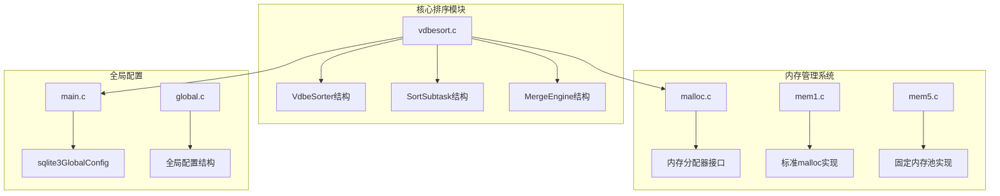
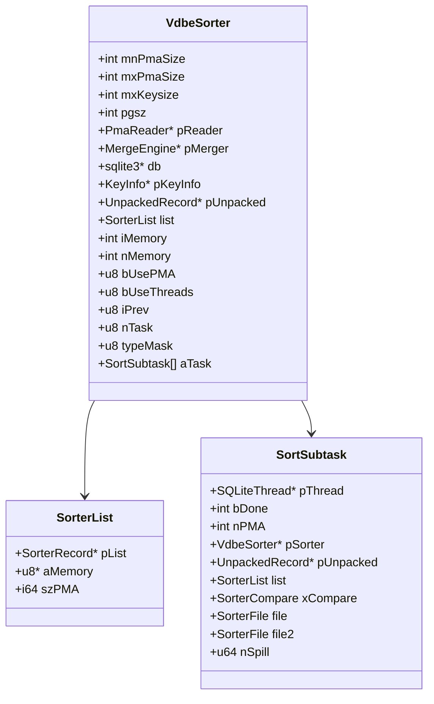
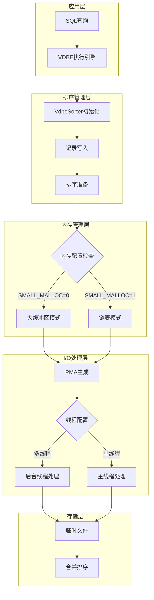
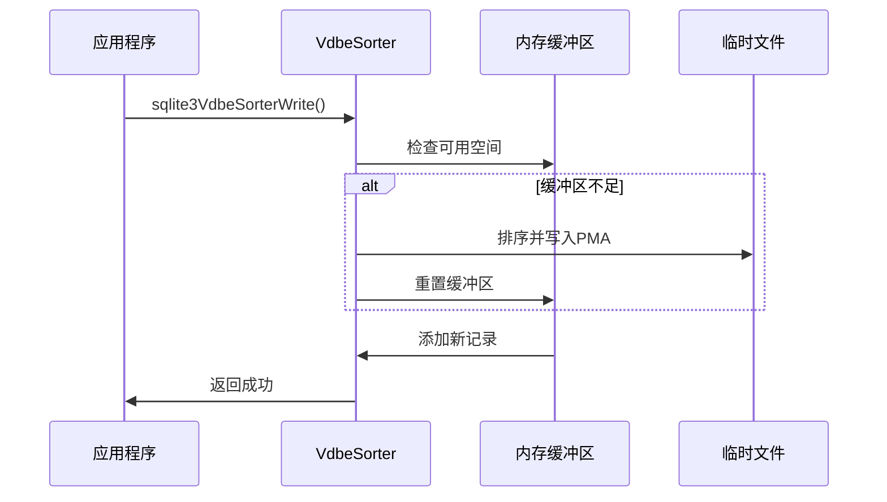
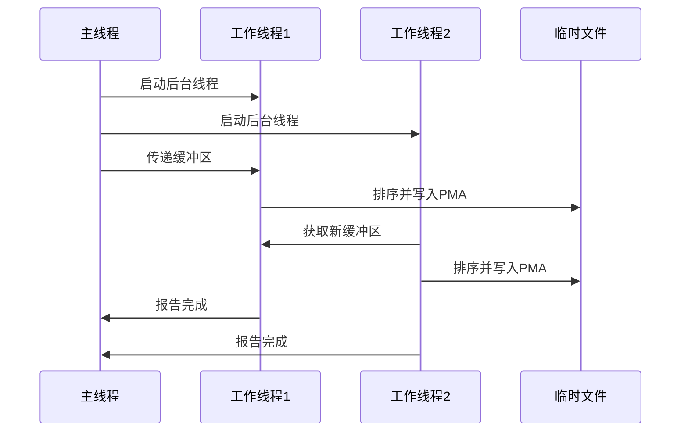
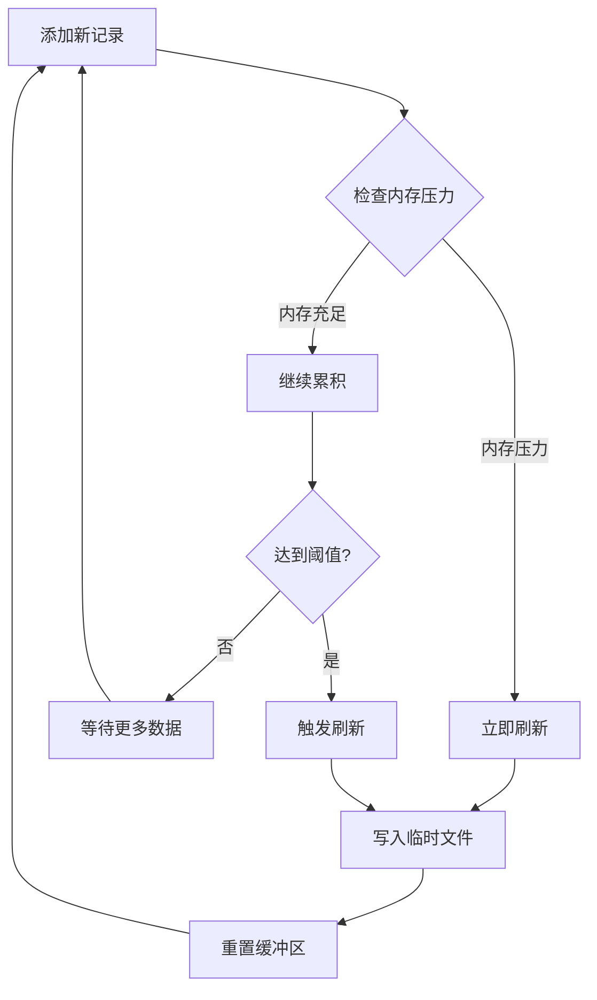
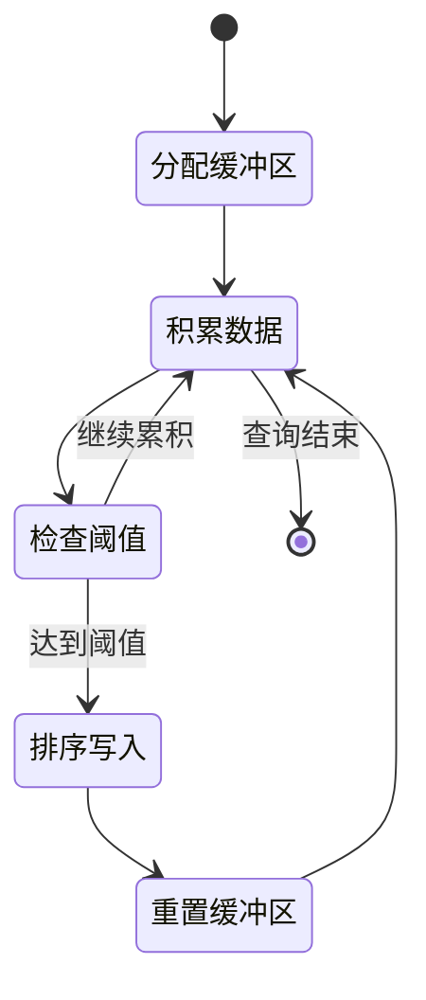
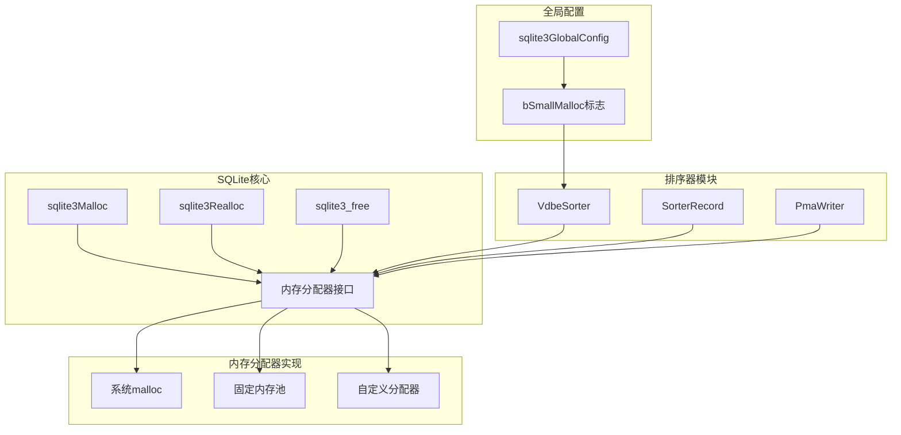

# VDBE排序内存管理

<cite>
**本文档中引用的文件**
- [vdbesort.c](file://src/vdbesort.c)
- [malloc.c](file://src/malloc.c)
- [mem1.c](file://src/mem1.c)
- [mem5.c](file://src/mem5.c)
- [main.c](file://src/main.c)
- [global.c](file://src/global.c)
- [vdbeInt.h](file://src/vdbeInt.h)
- [vdbesort-memory.md](file://doc/vdbesort-memory.md)
</cite>

## 目录
1. [简介](#简介)
2. [项目结构概述](#项目结构概述)
3. [核心组件分析](#核心组件分析)
4. [架构概览](#架构概览)
5. [详细组件分析](#详细组件分析)
6. [依赖关系分析](#依赖关系分析)
7. [性能考虑](#性能考虑)
8. [故障排除指南](#故障排除指南)
9. [结论](#结论)

## 简介

SQLite的VDBE排序器（vdbesort.c）是一个高度优化的外部合并排序算法实现，专门用于处理大型排序查询。该系统通过智能的内存分配策略和多线程支持，在不同配置下提供卓越的性能表现。本文档深入分析了SQLite在`SQLITE_CONFIG_SMALL_MALLOC`配置开启与关闭状态下的内存管理差异，以及这些差异对排序性能的影响。

## 项目结构概述

VDBE排序器位于SQLite源码的`src/`目录下，主要包含以下关键文件：

**图表来源**
- [vdbesort.c](file://src/vdbesort.c#L1-L50)
- [malloc.c](file://src/malloc.c#L1-L50)
- [main.c](file://src/main.c#L1-L50)

**章节来源**
- [vdbesort.c](file://src/vdbesort.c#L1-L100)
- [malloc.c](file://src/malloc.c#L1-L100)

## 核心组件分析

### VdbeSorter结构体

VdbeSorter是排序器的核心数据结构，负责管理整个排序过程的状态和资源：

**图表来源**
- [vdbesort.c](file://src/vdbesort.c#L400-L450)
- [vdbesort.c](file://src/vdbesort.c#L480-L520)

### 内存分配策略对比

SQLite提供了两种主要的内存分配模式：

| 配置选项 | SQLITE_CONFIG_SMALL_MALLOC=0 | SQLITE_CONFIG_SMALL_MALLOC=1 |
|---------|-----------------------------|-------------------------------|
| **内存分配方式** | 单一大缓冲区 | 堆内存链表 |
| **缓冲区增长** | 使用sqlite3Realloc()动态扩展 | 每个元素单独分配 |
| **内存压力检测** | 基于cache_size阈值 | 调用sqlite3HeapNearlyFull() |
| **性能特点** | 高效的连续内存访问 | 更灵活的内存管理 |
| **适用场景** | 大多数排序操作 | 内存受限环境 |

**章节来源**
- [vdbesort-memory.md](file://doc/vdbesort-memory.md#L1-L49)
- [vdbesort.c](file://src/vdbesort.c#L1013-L1056)

## 架构概览

VDBE排序器采用分层架构设计，支持单线程和多线程两种运行模式：

**图表来源**
- [vdbesort.c](file://src/vdbesort.c#L1000-L1100)
- [vdbesort.c](file://src/vdbesort.c#L1771-L1819)

## 详细组件分析

### 单线程模式内存管理

在单线程模式下，排序器使用单一的大缓冲区进行内存管理：

**图表来源**
- [vdbesort.c](file://src/vdbesort.c#L1771-L1819)
- [vdbesort.c](file://src/vdbesort.c#L1820-L1900)

### 多线程模式内存管理

多线程模式下，排序器使用多个缓冲区和后台线程：

**图表来源**
- [vdbesort.c](file://src/vdbesort.c#L1705-L1738)
- [vdbesort.c](file://src/vdbesort.c#L1771-L1819)

### 内存压力检测机制

当`SQLITE_CONFIG_SMALL_MALLOC`启用时，排序器使用`sqlite3HeapNearlyFull()`进行动态内存压力检测：

**图表来源**
- [vdbesort.c](file://src/vdbesort.c#L1820-L1880)
- [malloc.c](file://src/malloc.c#L174-L221)

**章节来源**
- [vdbesort.c](file://src/vdbesort.c#L1820-L1900)
- [malloc.c](file://src/malloc.c#L174-L221)

### 缓冲区生命周期管理

所有缓冲区都由主线程分配并与特定的数据库连接绑定：

**图表来源**
- [vdbesort.c](file://src/vdbesort.c#L1013-L1056)
- [vdbesort.c](file://src/vdbesort.c#L1276-L1319)

**章节来源**
- [vdbesort.c](file://src/vdbesort.c#L1013-L1100)
- [vdbesort.c](file://src/vdbesort.c#L1276-L1319)

## 依赖关系分析

VDBE排序器与SQLite内存管理系统紧密集成：

**图表来源**
- [malloc.c](file://src/malloc.c#L1-L50)
- [main.c](file://src/main.c#L519-L525)
- [global.c](file://src/global.c#L233-L265)

**章节来源**
- [malloc.c](file://src/malloc.c#L1-L100)
- [main.c](file://src/main.c#L519-L525)
- [global.c](file://src/global.c#L233-L265)

## 性能考虑

### 内存使用优化

1. **缓存大小阈值**：排序器使用主数据库页面大小乘以缓存大小作为内存阈值
2. **多缓冲区机制**：在多线程模式下，最多可同时使用(nWorker+1)个缓冲区
3. **延迟写入策略**：只有在必要时才将数据写入临时文件

### 性能影响因素

| 因素 | SMALL_MALLOC=0 | SMALL_MALLOC=1 |
|------|---------------|---------------|
| **内存碎片** | 较少，连续内存块 | 可能较多，分散分配 |
| **分配开销** | 较低，批量操作 | 较高，频繁小块分配 |
| **缓存局部性** | 优秀，连续访问 | 一般，随机访问 |
| **内存压力响应** | 基于阈值 | 实时响应 |

### 大型排序查询优化

对于大型排序查询，排序器采用以下优化策略：

1. **分阶段处理**：将大数据集分解为多个较小的PMA
2. **并行处理**：利用多核CPU加速排序过程
3. **智能合并**：根据PMAs数量选择最优的合并策略

## 故障排除指南

### 常见内存问题

1. **内存不足错误**
   - 检查`PRAGMA cache_size`设置
   - 考虑启用`SQLITE_CONFIG_SMALL_MALLOC`
   - 监控内存使用情况

2. **性能下降**
   - 分析内存压力日志
   - 调整工作线程数量
   - 优化排序键的选择

3. **临时文件过多**
   - 检查磁盘空间
   - 调整PMA大小参数
   - 清理旧的临时文件

**章节来源**
- [vdbesort.c](file://src/vdbesort.c#L1820-L1900)
- [malloc.c](file://src/malloc.c#L83-L122)

## 结论

SQLite的VDBE排序器通过精心设计的内存分配策略，在不同配置下都能提供出色的性能表现。`SQLITE_CONFIG_SMALL_MALLOC`配置的引入为不同的应用场景提供了灵活的内存管理选项：

- **关闭状态**（SMALL_MALLOC=0）：适合大多数排序操作，提供高效的连续内存访问
- **开启状态**（SMALL_MALLOC=1）：适合内存受限环境，提供实时的内存压力响应

这种双重策略确保了SQLite能够在各种硬件配置和工作负载下保持优异的排序性能，同时为开发者提供了细粒度的内存控制能力。

通过理解这些内存管理机制，开发者可以更好地配置SQLite以满足特定的应用需求，从而获得最佳的排序性能和资源利用率。