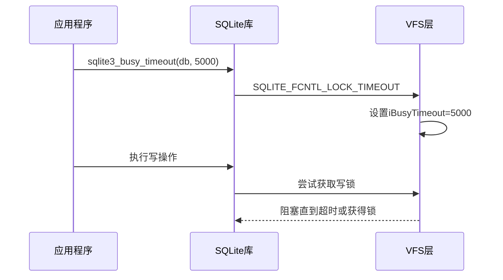

# WAL模式锁机制

<cite>
**本文档中引用的文件**  
- [wal.c](file://src/wal.c)
- [wal.h](file://src/wal.h)
- [os_unix.c](file://src/os_unix.c)
- [main.c](file://src/main.c)
- [wal-lock.md](file://doc/wal-lock.md)
</cite>

## 目录
1. [引言](#引言)
2. [WAL锁机制概述](#wal锁机制概述)
3. [POSIX阻塞锁配置](#posix阻塞锁配置)
4. [客户端锁获取行为](#客户端锁获取行为)
5. [阻塞锁的优势](#阻塞锁的优势)
6. [死锁风险与检测](#死锁风险与检测)
7. [调优建议](#调优建议)
8. [结论](#结论)

## 引言
本文深入分析SQLite在WAL（Write-Ahead Logging）模式下的锁机制实现。详细解释POSIX阻塞锁的使用条件和配置方式，包括SQLITE_ENABLE_SETLK_TIMEOUT编译选项和sqlite3_busy_timeout() API的协同工作原理。阐述不同数据库客户端（读、写、检查点）在WAL恢复、读取、写入和检查点操作中获取锁的顺序与行为差异。

## WAL锁机制概述
WAL模式使用共享内存（shm）文件中的字节级锁来协调多个客户端的并发访问。这些锁包括写锁（WAL_WRITE_LOCK）、检查点锁（WAL_CKPT_LOCK）、恢复锁（WAL_RECOVER_LOCK）和多个读锁（WAL_READ_LOCK）。锁的字节偏移量在WALINDEX_LOCK_OFFSET（120）处开始。

**Section sources**
- [wal.c](file://src/wal.c#L279-L304)
- [wal.c](file://src/wal.c#L1655-L1684)

## POSIX阻塞锁配置
POSIX阻塞锁通过SQLITE_ENABLE_SETLK_TIMEOUT编译选项启用。当启用时，sqlite3_busy_timeout() API设置的超时值会传递给VFS层，用于配置阻塞锁的超时时间。阻塞锁通过SQLITE_FCNTL_LOCK_TIMEOUT文件控制操作实现。

**Diagram sources**
- [main.c](file://src/main.c#L1829-L1848)
- [os_unix.c](file://src/os_unix.c#L4070-L4100)

**Section sources**
- [wal.c](file://src/wal.c#L2012-L2049)
- [main.c](file://src/main.c#L1829-L1848)

## 客户端锁获取行为
不同类型的数据库客户端在执行操作时获取锁的顺序和行为有所不同：

### WAL恢复
当数据库客户端从零连接变为一个连接时，需要进行WAL恢复。在此过程中，首先获取独占的WRITER锁。配置阻塞锁后，第二个客户端会在WRITER锁上阻塞。

### 数据库读取器
只读客户端通常不需要阻塞锁，因为它们不会被其他客户端阻塞。但在打开快照时，需要短暂获取CHECKPOINTER锁，此时可能使用阻塞锁。

### 数据库写入器
数据库写入器必须获取独占的WRITER锁。在以下情况下使用阻塞锁：
- 单个DML或DDL语句的隐式事务
- 使用BEGIN IMMEDIATE或BEGIN EXCLUSIVE打开的事务
- BEGIN命令后执行的第一个SQL语句是DML或DDL语句

### 数据库检查点
检查点操作按顺序获取以下锁，全部使用阻塞锁：
1. 独占的CHECKPOINTER锁
2. 独占的WRITER锁（仅FULL、RESTART和TRUNCATE）
3. 读标记槽1-N的独占锁（立即释放）
4. 读标记0的独占锁
5. 读标记槽1-N的独占锁再次（仅RESTART和TRUNCATE）

**Section sources**
- [wal-lock.md](file://doc/wal-lock.md#L1-L88)
- [wal.c](file://src/wal.c#L3662-L3704)

## 阻塞锁的优势
阻塞锁相比轮询机制具有显著优势：

### 避免轮询
阻塞锁避免了客户端持续轮询数据库锁状态，减少了CPU资源消耗。当锁不可用时，操作系统会将进程挂起，直到锁可用或超时。

### 提升优先级传递效率
阻塞锁支持操作系统级的优先级继承，当高优先级进程被低优先级进程阻塞时，可以临时提升低优先级进程的优先级，避免优先级反转问题。

### 防止大多数死锁场景
在单数据库访问场景下，阻塞锁机制能有效防止死锁。只有当线程或进程同时锁定多个数据库时才可能出现死锁，此时操作系统通常能够检测到并返回错误。

**Section sources**
- [wal-lock.md](file://doc/wal-lock.md#L72-L88)

## 死锁风险与检测
尽管阻塞锁机制能防止大多数死锁场景，但在多数据库并发访问时仍存在潜在风险：

### 死锁条件
当多个线程或进程以不同顺序访问多个数据库时，可能形成循环等待，导致死锁。例如：
- 进程A持有数据库1的锁，等待数据库2的锁
- 进程B持有数据库2的锁，等待数据库1的锁

### 操作系统级检测
现代操作系统通常具备死锁检测机制。当检测到死锁时，会终止其中一个进程或返回错误码，避免系统完全停滞。SQLite通过返回SQLITE_BUSY或SQLITE_BUSY_TIMEOUT错误码来通知应用程序。

**Section sources**
- [notify.c](file://src/notify.c#L175-L207)

## 调优建议
为高级用户提供以下调优建议：

### 合理设置超时时间
平衡响应性与资源占用，建议设置合理的超时时间：
- 短超时（100-500ms）：适用于高并发、低延迟要求的场景
- 中等超时（1-5秒）：适用于大多数常规应用
- 长超时（30秒以上）：适用于批处理或后台任务

### 编译选项配置
确保在编译时启用SQLITE_ENABLE_SETLK_TIMEOUT选项，以支持阻塞锁功能。同时考虑启用SQLITE_ENABLE_SNAPSHOT等高级特性以增强并发性能。

### 监控与诊断
使用SQLite的跟踪功能监控锁行为，及时发现潜在的性能瓶颈。通过分析SQLITE_BUSY错误的频率和分布，优化应用程序的并发控制策略。

**Section sources**
- [main.c](file://src/main.c#L1699-L1770)

## 结论
SQLite在WAL模式下的锁机制通过POSIX阻塞锁实现了高效的并发控制。通过SQLITE_ENABLE_SETLK_TIMEOUT编译选项和sqlite3_busy_timeout() API的协同工作，有效避免了轮询，提升了优先级传递效率，并防止了大多数死锁场景。合理配置超时时间和编译选项，可以显著提升多客户端并发访问时的性能和稳定性。