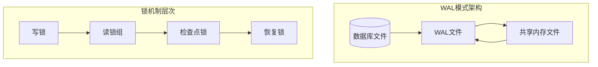
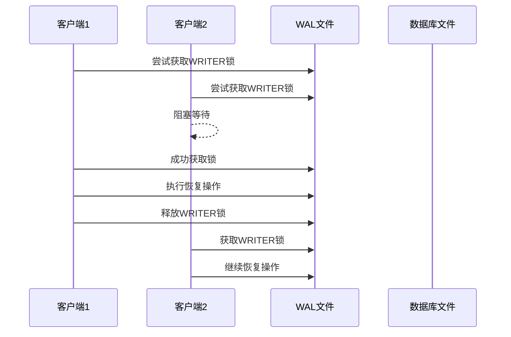
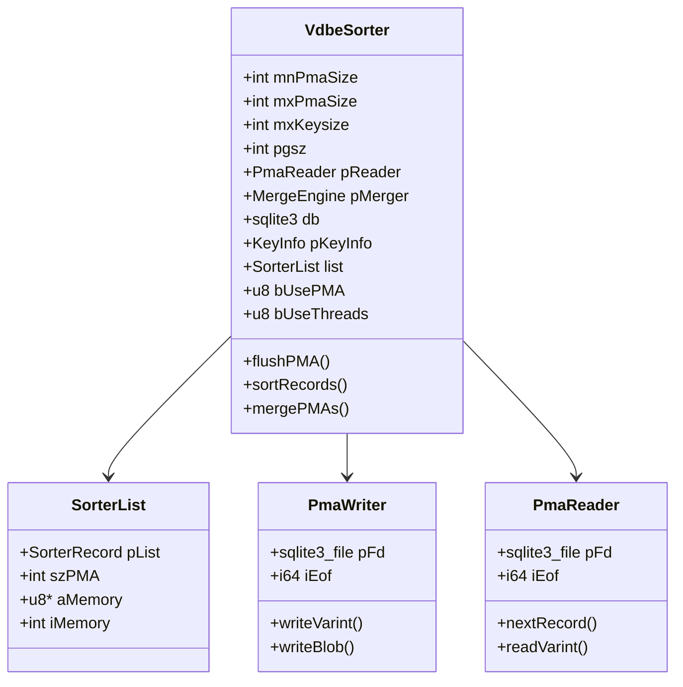
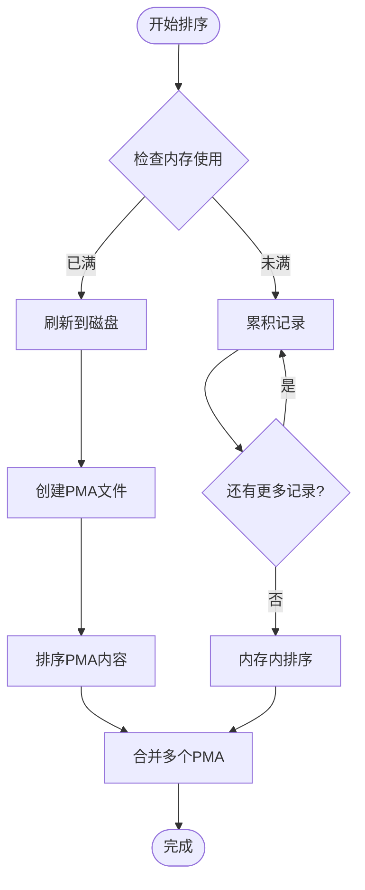
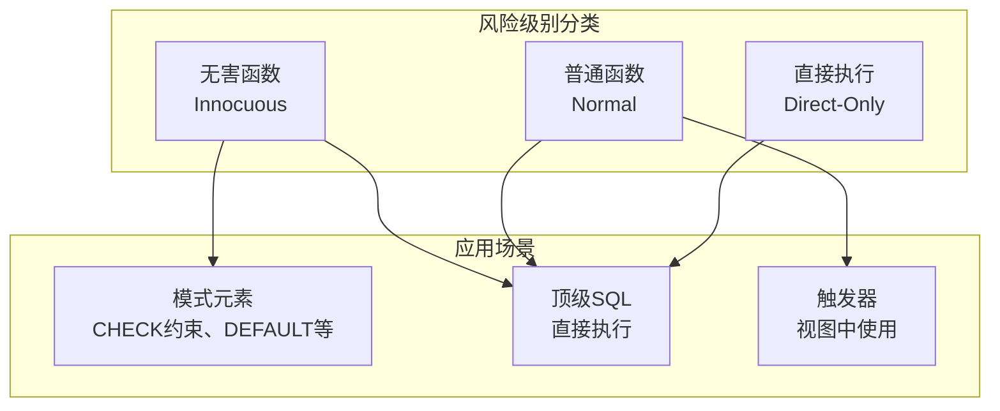
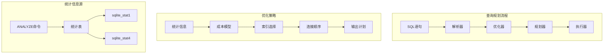
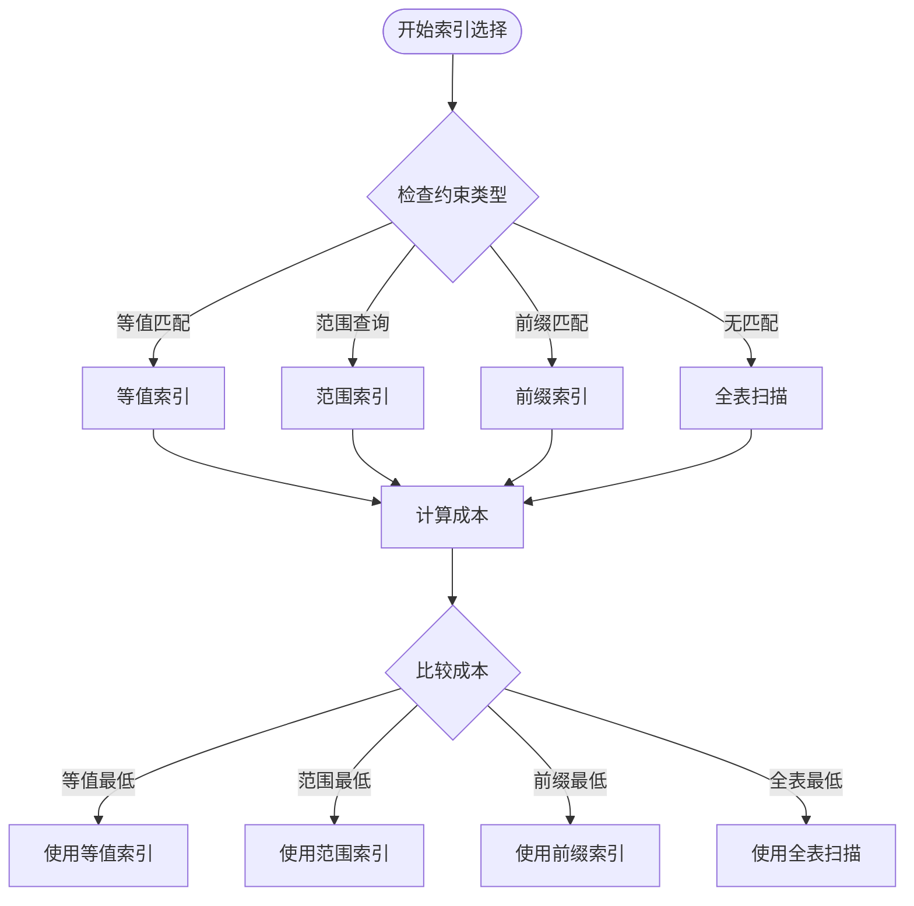
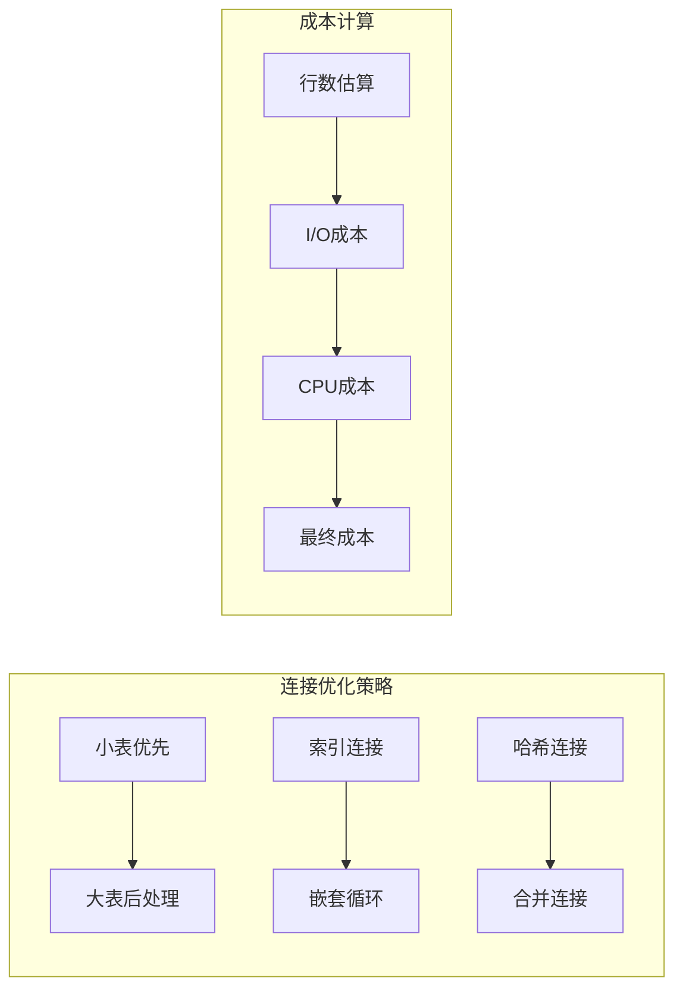
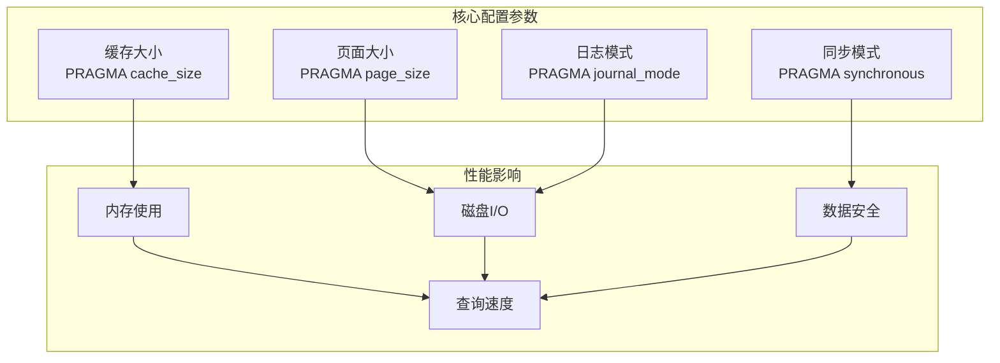
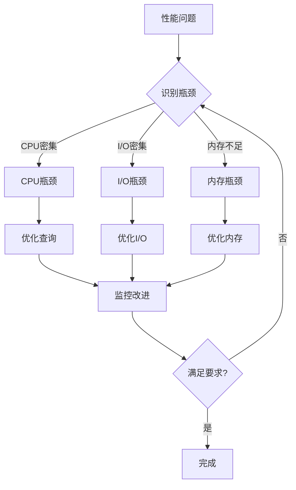

# SQLite高级主题深度技术文档

<cite>
**本文档中引用的文件**
- [doc/wal-lock.md](file://doc/wal-lock.md)
- [doc/vdbesort-memory.md](file://doc/vdbesort-memory.md)
- [doc/trusted-schema.md](file://doc/trusted-schema.md)
- [src/wal.c](file://src/wal.c)
- [src/vdbe.c](file://src/vdbe.c)
- [src/vdbeaux.c](file://src/vdbeaux.c)
- [src/vdbesort.c](file://src/vdbesort.c)
- [src/analyze.c](file://src/analyze.c)
- [src/pragma.c](file://src/pragma.c)
- [src/where.c](file://src/where.c)
- [src/select.c](file://src/select.c)
</cite>

## 目录
1. [简介](#简介)
2. [Write-Ahead Logging (WAL) 模式锁机制](#write-ahead-logging-wal-模式锁机制)
3. [VDBE排序操作内存管理](#vdbesort排序操作内存管理)
4. [可信模式安全机制](#可信模式安全机制)
5. [查询规划器与索引选择策略](#查询规划器与索引选择策略)
6. [性能监控与调优指南](#性能监控与调优指南)
7. [故障排查与诊断](#故障排查与诊断)
8. [总结](#总结)

## 简介

SQLite作为世界上部署最广泛的数据库引擎，其内部实现包含了许多高级技术和优化策略。本文档深入探讨SQLite的四个核心高级主题：Write-Ahead Logging (WAL) 模式的锁机制和并发性能优势、VDBE排序操作的内存管理策略、可信模式的安全含义以及查询规划器的决策过程。这些主题对于数据库管理员和高级开发者理解SQLite的内部工作原理至关重要。

## Write-Ahead Logging (WAL) 模式锁机制

### WAL模式概述

Write-Ahead Logging (WAL) 是SQLite的一种高级事务模式，它提供了比传统回滚日志模式更好的并发性能和可靠性。WAL模式通过维护一个单独的日志文件来记录所有修改，而不是直接修改数据库文件。



**图表来源**
- [src/wal.c](file://src/wal.c#L1-L100)
- [doc/wal-lock.md](file://doc/wal-lock.md#L1-L50)

### 锁机制详解

WAL模式采用分层锁机制来确保数据一致性和并发控制：

#### 写锁 (WRITE_LOCK)
- **用途**: 防止多个写操作同时进行
- **特性**: 排他性锁，独占访问WAL文件
- **触发条件**: 开始写事务时获取

#### 读锁 (READ_LOCK)
- **数量**: 支持最多5个并发读取者
- **特性**: 共享锁，允许多个读取者同时访问
- **实现**: 使用共享内存中的字节锁

#### 检查点锁 (CKPT_LOCK)
- **用途**: 控制WAL到数据库的转换过程
- **阶段**: 
  - 获取检查点锁
  - 获取写锁（仅在FULL、RESTART、TRUNCATE模式）
  - 执行实际的数据迁移

**章节来源**
- [doc/wal-lock.md](file://doc/wal-lock.md#L40-L89)

### 并发性能优势

WAL模式相比传统模式具有显著的并发性能优势：

#### 读写分离
- 读者不阻塞写者
- 写者不阻塞读者
- 支持真正的多版本并发控制(MVCC)

#### 锁竞争减少
- 多个读者可以同时进行
- 写操作只影响写者本身
- 减少锁等待时间

#### 性能对比

| 特性 | 传统模式 | WAL模式 |
|------|----------|---------|
| 读并发度 | 低 | 高 |
| 写并发度 | 低 | 中等 |
| 锁竞争 | 高 | 低 |
| 数据一致性 | 强 | 强 |
| 性能开销 | 低 | 中等 |

### 恢复机制

WAL模式的恢复过程需要特殊的锁处理：



**图表来源**
- [doc/wal-lock.md](file://doc/wal-lock.md#L20-L40)

**章节来源**
- [src/wal.c](file://src/wal.c#L100-L300)

## VDBE排序操作内存管理

### VDBE排序器架构

SQLite的虚拟数据库引擎(VDBE)在处理大型查询时需要高效的内存管理策略。排序操作是其中的关键组件，涉及复杂的内存分配和临时文件管理。



**图表来源**
- [src/vdbesort.c](file://src/vdbesort.c#L308-L350)

### 内存分配策略

VDBE排序器根据配置参数采用不同的内存分配策略：

#### SQLITE_CONFIG_SMALL_MALLOC=0 (默认)
- **大缓冲区模式**: 使用单个大型内存缓冲区
- **动态扩展**: 基于缓存大小限制动态增长
- **阈值控制**: 当达到缓存大小限制时写入临时文件

#### SQLITE_CONFIG_SMALL_MALLOC=1
- **小分配模式**: 为每个记录单独分配内存
- **链表结构**: 使用堆内存链表存储记录
- **及时刷新**: 当内存接近满时立即刷新到磁盘

**章节来源**
- [doc/vdbesort-memory.md](file://doc/vdbesort-memory.md#L1-L50)

### 排序算法优化

VDBE排序器实现了高效的外部排序算法：

#### 归并排序实现


**图表来源**
- [src/vdbesort.c](file://src/vdbesort.c#L1418-L1467)

#### 工作线程支持
当启用工作线程时，排序器可以利用多核处理器：
- **并行处理**: 主线程负责累积，工作线程负责排序
- **流水线操作**: 缓冲区重用机制
- **负载均衡**: 自动调整线程数量

### 性能调优参数

| 参数 | 描述 | 默认值 | 调优建议 |
|------|------|--------|----------|
| cache_size | 缓存大小限制 | 页面数 | 根据可用内存调整 |
| temp_store | 临时存储位置 | DEFAULT | MEMORY或FILE |
| max_worker_threads | 最大工作线程数 | 0 | CPU核心数的1-2倍 |
| page_size | 页面大小 | 4096字节 | 根据数据特征选择 |

**章节来源**
- [src/vdbesort.c](file://src/vdbesort.c#L979-L1011)

## 可信模式安全机制

### 安全威胁模型

可信模式(Trusted Schema)是SQLite为防止恶意攻击而设计的安全机制。它通过标记SQL函数和虚拟表的风险级别来限制潜在的安全漏洞。



**图表来源**
- [doc/trusted-schema.md](file://doc/trusted-schema.md#L19-L56)

### 风险级别定义

#### 无害函数 (Innocuous)
- **特征**: 仅读取数据库内容，不产生副作用
- **示例**: `abs()`, `length()`, `substr()`
- **使用场景**: 任何上下文都安全

#### 普通函数 (Normal)
- **特征**: 在TRUSTED_SCHEMA=ON时安全，在OFF时视为Direct-Only
- **行为**: 根据信任模式动态调整安全性
- **默认状态**: 应用程序定义的函数默认为此级别

#### 直接执行函数 (Direct-Only)
- **特征**: 可能产生外部副作用或泄露信息
- **示例**: `readfile()`, `writefile()`, `fts3_tokenizer()`
- **限制**: 不能在模式元素或触发器中使用

**章节来源**
- [doc/trusted-schema.md](file://doc/trusted-schema.md#L35-L56)

### 实现机制

#### 编译时配置
```c
// 启用可信模式功能
#define SQLITE_TRUSTED_SCHEMA 1

// 设置默认信任级别
#if defined(SQLITE_TRUSTED_SCHEMA)
# define SQLITE_TRUSTED_SCHEMA_DEFAULT 1
#else
# define SQLITE_TRUSTED_SCHEMA_DEFAULT 0
#endif
```

#### 运行时控制
```sql
-- 设置信任模式
PRAGMA trusted_schema = ON;
PRAGMA trusted_schema = OFF;

-- 查询函数列表
SELECT name, builtin, type, enc, narg, flags 
FROM pragma_function_list;
```

#### 函数注册时的标记
```c
// 注册无害函数
sqlite3_create_function(db, "safe_func", 1, 
                       SQLITE_UTF8 | SQLITE_INNOCUOUS,
                       0, safe_func, 0, 0);

// 注册直接执行函数  
sqlite3_create_function(db, "danger_func", 1, 
                       SQLITE_UTF8 | SQLITE_DIRECTONLY,
                       0, danger_func, 0, 0);
```

**章节来源**
- [doc/trusted-schema.md](file://doc/trusted-schema.md#L80-L124)

### 安全最佳实践

#### 部署环境建议
- **生产环境**: 设置 `PRAGMA trusted_schema = OFF`
- **开发环境**: 可设置为 `ON` 以提高兼容性
- **混合环境**: 根据具体需求动态切换

#### 应用程序安全策略
- **最小权限原则**: 仅注册必要的函数
- **输入验证**: 对用户提供的SQL进行严格验证
- **审计日志**: 记录所有函数调用和模式变更

#### 故障检测
```sql
-- 检查可疑的模式元素
SELECT name, sql 
FROM sqlite_master 
WHERE sql LIKE '%CREATE FUNCTION%' 
   OR sql LIKE '%CREATE TRIGGER%'
   OR sql LIKE '%CREATE VIEW%';
```

**章节来源**
- [doc/trusted-schema.md](file://doc/trusted-schema.md#L125-L143)

## 查询规划器与索引选择策略

### 查询规划器架构

SQLite的查询规划器是一个复杂的系统，负责为SQL查询生成最优的执行计划。它基于统计信息和启发式算法来做出决策。



**图表来源**
- [src/where.c](file://src/where.c#L1-L50)
- [src/analyze.c](file://src/analyze.c#L1-L50)

### 索引选择算法

查询规划器使用多种策略来选择最优索引：

#### 基本索引选择


**图表来源**
- [src/where.c](file://src/where.c#L5701-L5742)

#### 多列索引优化
查询规划器能够智能地利用多列索引：

| 索引列 | WHERE条件 | 匹配情况 | 优化效果 |
|--------|-----------|----------|----------|
| (A,B,C) | A=? AND B=? AND C=? | 完全匹配 | 最佳性能 |
| (A,B,C) | A=? AND B>? | 前缀匹配 | 良好性能 |
| (A,B,C) | B=? AND C=? | 跳过前缀 | 性能下降 |
| (A,B,C) | A=? AND C=? | 跳过中间列 | 性能下降 |

### 统计信息收集

ANALYZE命令收集的统计信息对查询规划至关重要：

#### sqlite_stat1格式
```sql
-- 表统计
CREATE TABLE sqlite_stat1(tbl, idx, stat);

-- 示例数据
-- tbl: employees
-- idx: NULL (表级统计)
-- stat: '1000 unordered'

-- 索引统计
-- tbl: employees
-- idx: idx_department
-- stat: '100 10' (100行, 平均10行有相同部门值)
```

#### sqlite_stat4增强统计
```sql
-- sqlite_stat4提供更详细的分布信息
CREATE TABLE sqlite_stat4(
    tbl, idx, neq, nlt, ndlt, sample
);

-- neq: 等值计数数组
-- nlt: 小于计数数组  
-- ndlt: 不同小于计数数组
-- sample: 样本键值
```

**章节来源**
- [src/analyze.c](file://src/analyze.c#L50-L150)

### 查询优化技术

#### 连接顺序优化


**图表来源**
- [src/where.c](file://src/where.c#L5466-L5493)

#### 特殊优化技术
- **常量折叠**: 在编译时计算常量表达式
- **子查询展开**: 将相关子查询转换为连接
- **索引覆盖**: 利用索引包含所有查询字段
- **延迟求值**: 只在需要时计算表达式

**章节来源**
- [src/where.c](file://src/where.c#L100-L200)

## 性能监控与调优指南

### 性能监控工具

#### PRAGMA命令集合

SQLite提供了丰富的PRAGMA命令用于性能监控：

| PRAGMA命令 | 功能描述 | 性能指标 |
|------------|----------|----------|
| `PRAGMA cache_size` | 设置页面缓存大小 | 内存使用量 |
| `PRAGMA journal_mode` | 设置日志模式 | I/O性能 |
| `PRAGMA synchronous` | 设置同步模式 | 数据安全性 |
| `PRAGMA temp_store` | 设置临时存储位置 | 临时文件性能 |
| `PRAGMA mmap_size` | 设置内存映射大小 | 大文件性能 |

#### EXPLAIN QUERY PLAN分析

```sql
-- 分析查询计划
EXPLAIN QUERY PLAN 
SELECT * FROM employees 
WHERE department = 'IT' AND salary > 5000;

-- 输出示例
-- QUERY PLAN
-- |--SEARCH employees USING INDEX idx_dept_salary (department=?)
-- |--SEARCH employees USING INDEX idx_salary (salary>?)
```

**章节来源**
- [src/pragma.c](file://src/pragma.c#L1-L100)

### 性能调优策略

#### 数据库配置优化



#### 索引优化策略

1. **选择性高的列优先**: 在WHERE条件中经常使用的列
2. **前缀匹配优化**: 多列索引时将选择性高的列放在前面
3. **复合索引设计**: 考虑查询的常见组合模式
4. **部分索引**: 为特定条件创建索引

#### 查询优化技巧

```sql
-- 使用索引覆盖查询
CREATE INDEX idx_covering ON employees(department, name, salary);

-- 避免隐式类型转换
SELECT * FROM employees WHERE department = 'IT'; -- 字符串字面量
SELECT * FROM employees WHERE department = 1;    -- 数字字面量

-- 使用EXISTS替代IN
SELECT * FROM orders o WHERE EXISTS (
    SELECT 1 FROM customers c WHERE c.id = o.customer_id
);
```

**章节来源**
- [src/select.c](file://src/select.c#L1-L100)

### 监控指标体系

#### 关键性能指标(KPI)

| 指标类别 | 具体指标 | 正常范围 | 警告阈值 |
|----------|----------|----------|----------|
| 查询性能 | 平均响应时间 | <100ms | >500ms |
| 资源使用 | 内存占用率 | <80% | >90% |
| I/O效率 | 缓存命中率 | >95% | <80% |
| 并发性能 | 锁等待时间 | <10ms | >100ms |

#### 性能基准测试

```sql
-- 基准测试脚本模板
BEGIN TRANSACTION;
-- 执行大量插入操作
INSERT INTO test_table VALUES (...);
-- 测试查询性能
EXPLAIN QUERY PLAN SELECT * FROM test_table WHERE ...
COMMIT;
```

## 故障排查与诊断

### 常见问题诊断

#### 性能问题诊断流程



#### 错误代码分析

| 错误代码 | 含义 | 可能原因 | 解决方案 |
|----------|------|----------|----------|
| SQLITE_BUSY | 数据库被锁定 | 并发冲突 | 检查锁超时设置 |
| SQLITE_NOMEM | 内存不足 | 缓存过大 | 调整cache_size |
| SQLITE_CORRUPT | 数据库损坏 | 硬件故障 | 使用PRAGMA integrity_check |
| SQLITE_IOERR | I/O错误 | 文件系统问题 | 检查磁盘空间和权限 |

### 调试工具使用

#### VDBE跟踪
```sql
-- 启用VDBE指令跟踪
PRAGMA vdbe_trace = ON;

-- 执行查询查看详细执行过程
SELECT * FROM employees WHERE department = 'IT';
```

#### 扫描状态监控
```sql
-- 启用扫描状态
PRAGMA stmt_scanstatus = ON;

-- 查询扫描状态信息
SELECT * FROM scanstatus();
```

**章节来源**
- [src/vdbe.c](file://src/vdbe.c#L100-L200)

### 预防性维护

#### 定期维护任务

1. **统计信息更新**
```sql
-- 更新统计信息
ANALYZE;
-- 或针对特定表
ANALYZE employees;
```

2. **数据库完整性检查**
```sql
-- 检查数据库完整性
PRAGMA integrity_check;

-- 检查表完整性
PRAGMA table_info(employees);
```

3. **索引重建**
```sql
-- 重建索引以消除碎片
REINDEX;
-- 或针对特定索引
REINDEX idx_department;
```

#### 监控告警设置

```sql
-- 设置性能监控触发器
CREATE TRIGGER IF NOT EXISTS performance_monitor
AFTER INSERT ON scanstatus
BEGIN
    SELECT CASE 
        WHEN NEW.cost > 1000 THEN 
            RAISE(IGNORE, 'Performance warning: High cost query detected')
    END;
END;
```

## 总结

SQLite的高级主题涵盖了数据库引擎的核心技术实现。通过对WAL模式锁机制的理解，开发者可以更好地设计高并发应用程序；VDBE排序操作的内存管理策略为处理大数据集提供了优化思路；可信模式的安全机制为部署环境提供了重要的安全保障；查询规划器的决策过程则展示了SQLite如何在各种复杂场景下做出最优选择。

掌握这些高级主题不仅有助于深入理解SQLite的工作原理，更能帮助开发者在实际项目中充分发挥SQLite的性能潜力，构建更加稳定、高效的应用系统。随着数据规模的增长和应用场景的复杂化，这些技术知识将成为数据库管理和系统优化的重要基础。