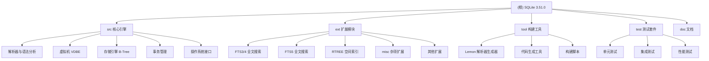

# SQLite 代码库 AI 上下文初始化

## 项目愿景

SQLite 是一个轻量级、高性能的嵌入式关系型数据库引擎，设计目标是成为一个自包含、无服务器、零配置、事务性的 SQL 数据库引擎。SQLite 以公共域授权发布，被广泛应用于移动设备、桌面应用、Web浏览器和各种嵌入式系统中。

## 架构总览

SQLite 采用模块化架构设计，主要由以下核心组件构成：

- **SQL 解析器**：基于 Lemon LALR(1) 解析器生成器的 SQL 语法分析
- **代码生成器**：将 SQL 语句转换为虚拟机字节码
- **虚拟数据库引擎 (VDBE)**：执行字节码的抽象虚拟机
- **B-Tree 存储引擎**：管理数据库文件的数据存储和索引
- **页面缓存和事务管理**：处理 ACID 事务特性
- **操作系统抽象层 (VFS)**：提供跨平台的文件系统接口

## ✨ 模块结构图



## 模块索引

| 模块 | 路径 | 主要职责 | 语言 |
|------|------|----------|------|
| 核心引擎 | [src/](./src/) | SQLite 核心功能实现 | C |
| 扩展模块 | [ext/](./ext/) | 各种功能扩展 | C |
| 构建工具 | [tool/](./tool/) | 代码生成和构建脚本 | C, Tcl |
| 测试套件 | [test/](./test/) | 测试脚本和测试数据 | Tcl, C |
| 文档 | [doc/](./doc/) | 内部技术文档 | Markdown |

## 运行与开发

### 构建要求

- **编译器**：支持 C99 标准的编译器（GCC、Clang、MSVC）
- **构建工具**：Make 或 nmake
- **运行时**：Tcl 8.6+ （用于测试）
- **可选依赖**：ICU、FTS、RTREE 等扩展库

### 标准构建流程

```bash
# Unix/Linux 系统
mkdir bld && cd bld
../sqlite/configure --enable-all
make sqlite3          # 构建 sqlite3 命令行工具
make sqlite3.c        # 生成 amalgamation 源文件
make test             # 运行测试套件

# Windows 系统
nmake /f Makefile.msc sqlite3.exe
nmake /f Makefile.msc sqlite3.c
nmake /f Makefile.msc test
```

### 关键构建目标

- `sqlite3.c` - Amalgamation 源文件（单一文件包含所有核心代码）
- `sqlite3.h` - 公共 API 头文件
- `sqlite3` - 命令行工具
- `testfixture` - 测试执行程序
- `sqldiff` - 数据库比较工具

## 测试策略

SQLite 采用多层次测试策略：

1. **单元测试**：针对单个模块的测试（`test1.c`, `test2.c` 等）
2. **集成测试**：完整功能的端到端测试（`*.test` 文件）
3. **性能测试**：基准测试和性能回归测试
4. **内存测试**：使用 Valgrind 进行内存泄漏检测
5. **模糊测试**：异常输入的鲁棒性测试

## 编码规范

### C 语言规范

- 遵循 SQLite 内部编码风格（2空格缩进，K&R 风格括号）
- 使用 `sqlite3_` 前缀命名公共 API
- 内部函数使用模块前缀（如 `btree_`, `pager_`）
- 错误处理：使用结果码和错误消息机制

### 内存管理

- 统一使用 SQLite 内存分配接口（`sqlite3_malloc`, `sqlite3_free`）
- 明确的所有权转移规则
- 使用 OOM（内存不足）测试机制

### 线程安全

- 核心引擎支持多线程，但不支持多进程并发访问同一数据库
- 连接级别的线程安全模式配置

## AI 使用指引

### 开发助手建议

1. **理解架构**：首先熟悉 VDBE、B-Tree、Pager 等核心概念
2. **阅读源码顺序**：建议从 `sqlite3.h` → `sqliteInt.h` → 具体实现模块
3. **测试驱动**：修改代码后务必运行完整测试套件
4. **性能考虑**：SQLite 对性能敏感，任何修改都需评估性能影响

### 调试技巧

- 使用 `.explain` 查看虚拟机字节码
- 启用调试模式获得更详细的错误信息
- 使用 `PRAGMA compile_options` 查看编译时选项

### 扩展开发

- 参考 `ext/misc/` 中的示例扩展
- 实现虚拟表接口使用标准 API
- 遵循加载和卸载生命周期管理

## 变更记录 (Changelog)

### 2025-11-19 09:20:15 - 初始化完成
- 创建根级别 CLAUDE.md 文档
- 建立项目模块结构图
- 识别核心模块：src/, ext/, tool/, test/, doc/
- 制定开发规范和AI使用指引
- **覆盖状态**：阶段A完成，阶段B进行中
- **模块覆盖**：5个主要模块已识别，待深入分析